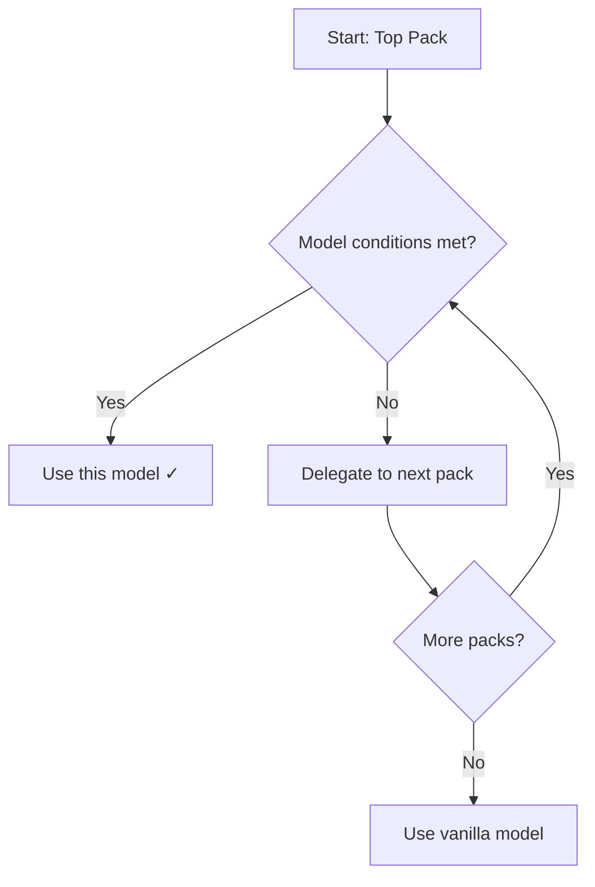
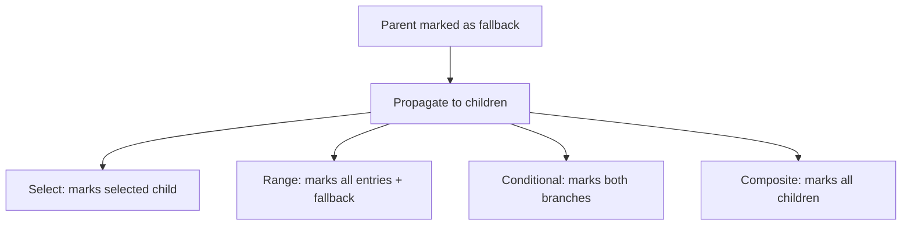

# Delegation System

The delegation system is the core mechanism that enables RPF to resolve conflicts between multiple resource packs. This page provides detailed information about how delegation works for each model type.

## Overview

When multiple packs provide models for the same item, RPF uses a **delegation chain** to decide which model should render:

1. Start with the highest priority pack (top of the pack list)
2. Check if the model's conditions are met
3. If conditions are met → use this model (delegation stops)
4. If conditions are not met → **delegate** to the next pack
5. Continue until a model is found or vanilla is reached



## The RpfItemModel Interface

All RPF-aware models implement the `RpfItemModel` interface, which provides the `rpf$doDelegate()` method. This method returns:

- `false` - Model will render (delegation stops)
- `true` - Model will delegate to the next pack

### Default Behavior

The default implementation delegates if the model is marked as a **fallback**:

```java
default boolean rpf$doDelegate(...) {
    if (rpf$isFallback()) {
        return true; // Delegate to next pack
    }
    return false; // Use this model
}
```

## Model-Specific Delegation Rules

Each model type has its own delegation logic. Understanding these rules is essential for creating compatible resource packs.

### Select Model

**Type:** `minecraft:select`

The `select` model chooses a child model based on a property value (like `custom_model_data`).

#### Delegation Rules

1. If `delegate` parameter is `false` → **never delegates** (forced rendering)
2. If the selected child model implements `RpfItemModel` → delegates to the child's logic
3. If the selected child model is not RPF-aware → delegates based on the `delegate` parameter

#### Configuration

```json
{
  "type": "minecraft:select",
  "property": "minecraft:custom_model_data",
  "cases": [
    { "when": 1, "model": "mypack:item/custom_sword" }
  ],
  "fallback": "minecraft:item/diamond_sword",
  "delegate": true  // ← Controls delegation (default: true)
}
```

#### Examples

**Example 1: Force rendering (no delegation)**

```json
{
  "type": "minecraft:select",
  "property": "minecraft:custom_model_data",
  "cases": [
    { "when": 5001, "model": "weapons:item/magic_staff" }
  ],
  "fallback": "minecraft:item/stick",
  "delegate": false  // ← This pack's model will always render
}
```

**Example 2: Compatible delegation**

```json
{
  "type": "minecraft:select",
  "property": "minecraft:custom_model_data",
  "cases": [
    { "when": 1001, "model": "texturepack:item/fancy_sword" }
  ],
  "fallback": "minecraft:item/diamond_sword",
  "delegate": true  // ← If CMD ≠ 1001, delegates to next pack
}
```

### Range Dispatch Model

**Type:** `minecraft:range_dispatch`

The `range_dispatch` model selects a child model based on a numeric property value (like `damage`, `cooldown`, `time`).

#### Delegation Rules

1. If `delegate` parameter is `false` → **never delegates**
2. Evaluates the property value to select a model from the `entries` array
3. If the value is `NaN` → uses the `fallback` model (marked as fallback)
4. Delegates to the selected child model if it implements `RpfItemModel`

#### Configuration

```json
{
  "type": "minecraft:range_dispatch",
  "property": "minecraft:damage",
  "scale": 1.0,
  "entries": [
    { "threshold": 0.0, "model": "mypack:item/sword_full" },
    { "threshold": 0.5, "model": "mypack:item/sword_damaged" }
  ],
  "fallback": "minecraft:item/diamond_sword",
  "delegate": true  // ← Controls delegation (default: true)
}
```

#### Example: Damage-based weapon textures

```json
{
  "type": "minecraft:range_dispatch",
  "property": "minecraft:damage",
  "scale": 1.0,
  "entries": [
    { "threshold": 0.0, "model": "weapons:item/blade_pristine" },
    { "threshold": 0.3, "model": "weapons:item/blade_worn" },
    { "threshold": 0.7, "model": "weapons:item/blade_damaged" },
    { "threshold": 0.9, "model": "weapons:item/blade_broken" }
  ],
  "fallback": "minecraft:item/iron_sword",
  "delegate": true
}
```

### Conditional Model

**Type:** `minecraft:conditional`

The `conditional` model chooses between two child models based on a boolean property.

#### Delegation Rules

1. Evaluates the `property` to determine which branch to follow
2. If `true` → delegates to `on_true` model
3. If `false` → delegates to `on_false` model
4. **Special behavior:** If the conditional model is at the root level (no parent), the `on_false` branch is automatically marked as a fallback

::: warning Important Fallback Behavior
The `on_false` branch is treated as a fallback when the conditional model is the root model. This means it will delegate by default unless its child explicitly prevents delegation.
:::

#### Configuration

```json
{
  "type": "minecraft:conditional",
  "property": "minecraft:custom_model_data",
  "on_true": "mypack:item/special_sword",
  "on_false": "minecraft:item/diamond_sword"
}
```

#### Example: Enchantment glow effect

```json
{
  "type": "minecraft:conditional",
  "property": "minecraft:has_component(minecraft:enchantments)",
  "on_true": "weapons:item/enchanted_sword",
  "on_false": {
    "type": "minecraft:select",
    "property": "minecraft:custom_model_data",
    "cases": [
      { "when": 1, "model": "weapons:item/custom_sword" }
    ],
    "fallback": "minecraft:item/diamond_sword",
    "delegate": true
  }
}
```

### Composite Model

**Type:** `minecraft:composite`

The `composite` model combines multiple child models (useful for overlays, decorations, etc.).

#### Delegation Strategies

The `delegate_strategy` parameter controls how child model delegation affects the composite:

| Strategy | Initial State | Behavior | Use Case |
|----------|--------------|----------|----------|
| `one_do_delegate` | false | If **any** child delegates → composite delegates | Default behavior, most compatible |
| `one_cancel_delegate` | true | If **any** child delegates → composite **doesn't** delegate | Force rendering if any child would delegate |
| `not_delegate` | false | Composite **never** delegates | Always render this composite |

#### Configuration

```json
{
  "type": "minecraft:composite",
  "models": [
    "mypack:item/sword_base",
    "mypack:item/sword_overlay"
  ],
  "delegate_strategy": "one_do_delegate"  // ← Default
}
```

#### Examples

**Example 1: Default strategy (one_do_delegate)**

```json
{
  "type": "minecraft:composite",
  "models": [
    {
      "type": "minecraft:select",
      "property": "minecraft:custom_model_data",
      "cases": [{ "when": 100, "model": "overlay:item/gem" }],
      "fallback": "minecraft:item/air",
      "delegate": true
    },
    {
      "type": "minecraft:model",
      "model": "minecraft:item/diamond_sword"
    }
  ],
  "delegate_strategy": "one_do_delegate"
}
```

If the first model delegates (CMD ≠ 100), the entire composite delegates.

**Example 2: Never delegate strategy**

```json
{
  "type": "minecraft:composite",
  "models": [
    "decorations:item/sword_base",
    "decorations:item/sword_glint"
  ],
  "delegate_strategy": "not_delegate"  // ← Always renders
}
```

This composite will always render, regardless of child model conditions.

### Empty Model

**Type:** `minecraft:empty`

The `empty` model renders nothing (invisible item).

#### Delegation Rules

**Never delegates** - always returns `false`.

If you want an item to be invisible in your pack but visible in lower-priority packs, **do not use `empty`**. Instead, use a `select` model with no matching cases:

```json
{
  "type": "minecraft:select",
  "property": "minecraft:custom_model_data",
  "cases": [],
  "fallback": "minecraft:item/air",
  "delegate": true
}
```

### Model Type (BlockModelWrapper)

**Type:** `minecraft:model`

The basic `model` type references another model by its resource location.

#### Delegation Rules

Delegates if **all three conditions** are true:

1. Model is marked as a fallback
2. Model namespace matches the item model ID namespace
3. Model path contains the item model ID path

This logic attempts to detect vanilla models and delegate appropriately.

::: tip Practical Tip
In practice, this means `minecraft:model` types will delegate if they reference vanilla models and are in a fallback context.
:::

#### Configuration

```json
{
  "type": "minecraft:model",
  "model": "minecraft:item/diamond_sword"
}
```

## Fallback State Propagation

When a model is marked as a **fallback**, it affects how its child models behave:



### Why Fallback Matters

Fallback models are typically vanilla models or models from lower-priority packs. Marking them as fallback ensures they delegate properly when higher-priority packs provide alternatives.

## Delegation in Practice

### Multi-Pack Scenario

Consider three packs:

1. **Texture Pack** (highest priority) - provides textures for CMD 1-100
2. **Weapons Pack** (middle) - provides models for CMD 5000-5999
3. **Vanilla** (lowest) - default Minecraft models

**Item:** Diamond Sword with CMD = 50

**Resolution process:**

```
1. Texture Pack
   ├─ type: select
   ├─ property: custom_model_data
   ├─ cases: [1, 2, 3, ..., 100]  ← 50 matches!
   └─ delegate: true
   → Checks if CMD = 50
   → ✓ Match found → Does NOT delegate
   → Uses: texturepack:item/sword_50
```

**Item:** Diamond Sword with CMD = 5500

**Resolution process:**

```
1. Texture Pack
   ├─ type: select
   ├─ cases: [1-100]  ← 5500 does NOT match
   └─ delegate: true
   → No match → DELEGATES

2. Weapons Pack
   ├─ type: select
   ├─ cases: [5000-5999]  ← 5500 matches!
   └─ delegate: true
   → ✓ Match found → Does NOT delegate
   → Uses: weapons:item/magic_staff
```

**Item:** Diamond Sword with CMD = 9999

**Resolution process:**

```
1. Texture Pack
   ├─ cases: [1-100]  ← No match
   └─ DELEGATES

2. Weapons Pack
   ├─ cases: [5000-5999]  ← No match
   └─ DELEGATES

3. Vanilla
   → Uses: minecraft:item/diamond_sword
```

## Common Delegation Patterns

### Pattern 1: Non-Conflicting CMD Ranges

Each pack uses different CMD ranges and delegates for unhandled values.

**Pack A (textures):**
```json
{
  "type": "minecraft:select",
  "property": "minecraft:custom_model_data",
  "cases": [
    { "when": 1, "model": "pack_a:item/texture_1" },
    { "when": 2, "model": "pack_a:item/texture_2" }
  ],
  "fallback": "minecraft:item/diamond_sword",
  "delegate": true
}
```

**Pack B (models):**
```json
{
  "type": "minecraft:select",
  "property": "minecraft:custom_model_data",
  "cases": [
    { "when": 1000, "model": "pack_b:item/model_1000" },
    { "when": 1001, "model": "pack_b:item/model_1001" }
  ],
  "fallback": "minecraft:item/diamond_sword",
  "delegate": true
}
```

### Pattern 2: Conditional Override with Fallback

Higher-priority pack overrides specific conditions, delegates otherwise.

```json
{
  "type": "minecraft:conditional",
  "property": "minecraft:has_component(minecraft:custom_name)",
  "on_true": "mypack:item/named_sword",
  "on_false": {
    "type": "minecraft:model",
    "model": "minecraft:item/diamond_sword"
  }
}
```

### Pattern 3: Composite with Optional Overlay

Add decorations without breaking compatibility.

```json
{
  "type": "minecraft:composite",
  "models": [
    {
      "type": "minecraft:select",
      "property": "minecraft:custom_model_data",
      "cases": [
        { "when": 99, "model": "decorations:item/sparkle" }
      ],
      "fallback": "minecraft:item/air",
      "delegate": true
    },
    {
      "type": "minecraft:model",
      "model": "minecraft:item/diamond_sword"
    }
  ],
  "delegate_strategy": "one_do_delegate"
}
```

If CMD = 99, the sparkle overlay + vanilla sword render. Otherwise, delegates to the next pack.

## Debugging Delegation

RPF provides detailed logs to help debug delegation issues. Enable debug logging in the RPF config:

```json
{
  "resolver": "v1",
  "debug": {
    "enabled": true,
    "log_level": "all"
  }
}
```

### Log Types

- `ALLOW_UPDATE` - Model conditions met, will render
- `DELEGATE` - Model conditions not met, delegating to next pack
- `NEXT_TEST` - Model delegates testing to a child model
- `NEXT_TEST_FALLBACK` - Model delegates to a fallback child
- `INFO` - General information about model resolution
- `ERROR` - Model not found or configuration errors

### Example Log Output

```
[RPF] Resolving: minecraft:diamond_sword (CMD=50)
[RPF] Testing: texturepack:models/item/diamond_sword.json
[RPF]   → NEXT_TEST: select model, property: custom_model_data
[RPF]   → ALLOW_UPDATE: property value: 50, model: texturepack:item/sword_50
```

See the [Debug Guide](./debug.md) for more information.

## Best Practices

1. **Always use `delegate: true`** unless you have a specific reason to force rendering
2. **Use distinct CMD ranges** for different packs to avoid conflicts
3. **Test with multiple packs enabled** to ensure proper delegation
4. **Mark vanilla fallbacks explicitly** in conditional models
5. **Use composite's `one_do_delegate` strategy** for maximum compatibility
6. **Avoid `empty` models** if you want lower packs to render - use `select` with no cases instead

## Next Steps

- Learn about [Model Types](./model-types.md) in detail
- Explore [Resolvers](./resolvers.md) and how they affect delegation
- Check out [Pack Developer Guide](./pack-developers.md) for practical examples
- Review [Best Practices](./best-practices.md) for multi-pack compatibility
