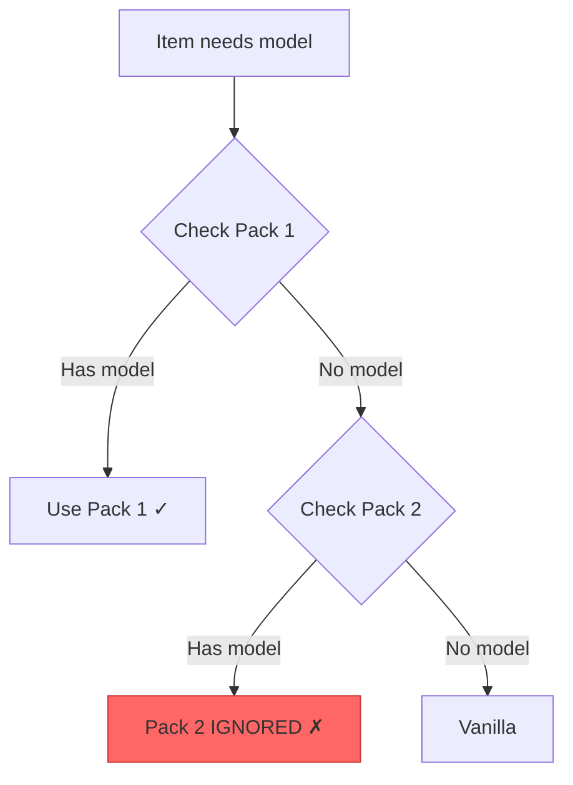
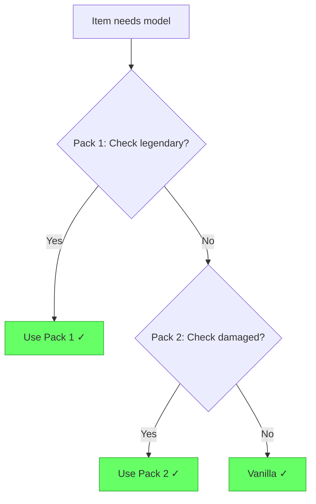
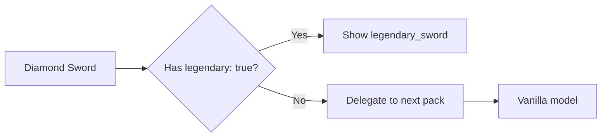

# Getting Started with RPF

Resource Packs Fusion (RPF) is a Minecraft mod that allows multiple resource packs to work together through a smart delegation system.

## The Problem

In vanilla Minecraft, when multiple resource packs modify the same item, only the **top-priority pack** is used. All other packs are completely ignored for that item.



**This means**: If Pack A and Pack B both modify diamond swords, only Pack A's version will ever be used, even if Pack B has better models for specific cases.

## The Solution: Delegation

RPF introduces **delegation** - a pack can check conditions and decide:
- ✅ **Use my model** if conditions match
- ➡️ **Delegate to next pack** if conditions don't match



**Now**: Both packs can work together - Pack A handles legendary swords, Pack B handles damaged swords, and vanilla handles everything else.

## Installation

### Requirements
- **Minecraft**: 1.21.8, 1.21.10, or 1.21.11+
- **Fabric Loader**
- **Fabric API**

### Download
1. Download RPF from [Modrinth](https://modrinth.com/mod/rpf) or [CurseForge](https://www.curseforge.com/minecraft/mc-mods/rpf)
2. Place the `.jar` file in your `mods` folder
3. Launch Minecraft with Fabric

::: tip
RPF works client-side only. No server installation needed!
:::

## Your First RPF Model

Let's create a resource pack that shows a special model for legendary diamond swords.

### 1. Create Pack Structure

```
MyCustomPack/
├── pack.mcmeta
└── assets/
    └── minecraft/
        └── items/
            └── diamond_sword.json
```

### 2. Basic Model with Delegation

**File**: `assets/minecraft/items/diamond_sword.json`

```json
{
  "model": {
    "type": "minecraft:select",
    "property": "minecraft:custom_data",
    "cases": [
      {
        "when": { "legendary": true },
        "model": {
          "type": "minecraft:model",
          "model": "item/legendary_sword"
        }
      }
    ],
    "delegate": true
  }
}
```

### 3. What This Does



- **If item has `legendary: true`** in custom data → Show `legendary_sword` model
- **Otherwise** → Delegate to the next pack (or vanilla)

::: tip Testing
Give yourself a legendary sword:
```
/give @p diamond_sword[custom_data={legendary:true}]
```
:::

## Key Concepts

### Delegation Parameter

The `delegate` parameter controls what happens when no case matches:

```json
{
  "delegate": true   // Pass to next pack (default)
}
```

```json
{
  "delegate": false  // Stop here, use this model anyway
}
```

::: warning Important
Always use `delegate: true` unless you specifically want to override ALL items, regardless of conditions.
:::

### Pack Priority

Packs are checked in order (top to bottom):

1. **Your Custom Pack** (highest priority)
2. **Another Pack**
3. **Yet Another Pack**
4. **Vanilla Resources** (lowest priority)

Each pack can either **handle** the item or **delegate** to the next pack.

## Next Steps

Now that you understand the basics:

- **[How It Works](./how-it-works.md)** - Deep dive into the delegation system
- **[Model Types](./model-types.md)** - Learn about different model types and their delegation behavior
- **[Pack Developers Guide](./pack-developers.md)** - Practical guide for creating RPF-compatible packs
- **[Debug & Logging](./debug.md)** - Tools for troubleshooting your packs

## Common Questions

### Do I need to change existing packs?

Existing packs work fine with RPF, but they won't delegate. Add `"delegate": true` to enable delegation features.

### Can I use RPF with other mods?

Yes! RPF is compatible with most mods. If you encounter issues, check the [Troubleshooting](./troubleshooting.md) guide.

### Does RPF affect performance?

No. RPF adds less than 0.1ms overhead per item render, which is imperceptible.

### Can I disable RPF temporarily?

Yes! Use the Vanilla resolver:
```
/rpf resolver set minecraft:vanilla
```

This disables delegation and reverts to vanilla behavior.
