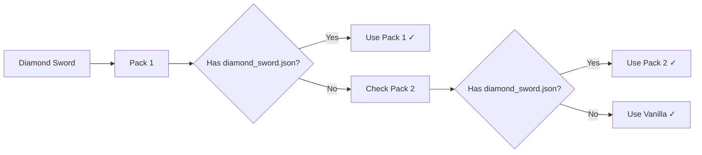
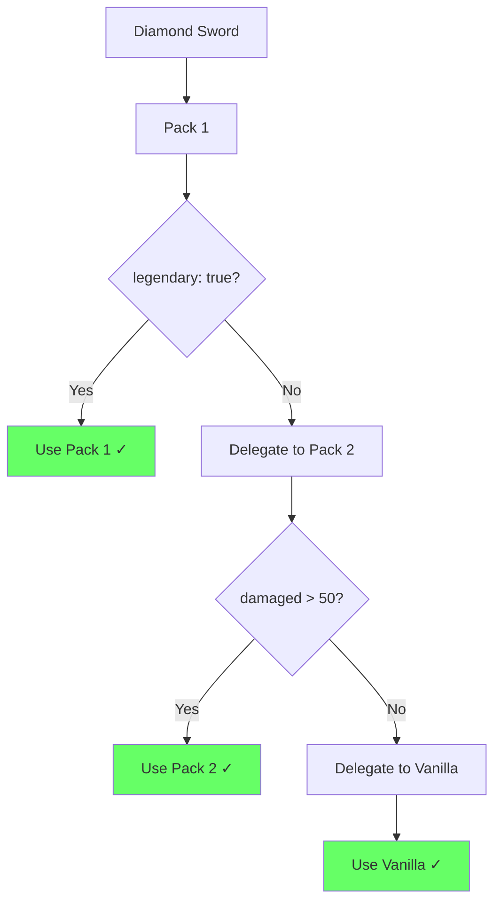
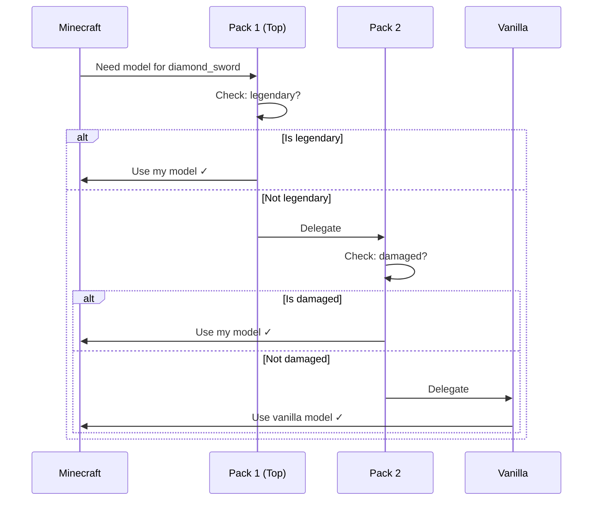
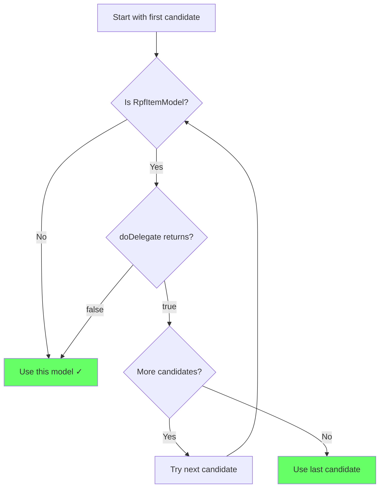
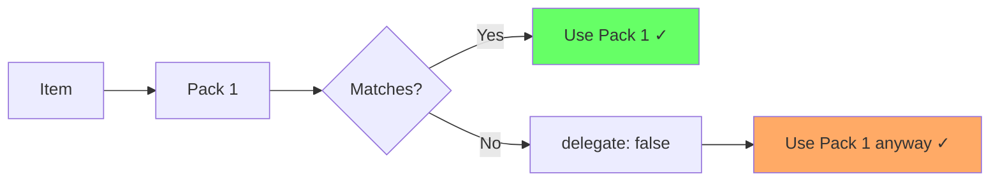

# How RPF Works

Understanding RPF's delegation system will help you create effective resource packs that work well with others.

## Vanilla Minecraft Behavior

In vanilla Minecraft, resource packs follow a simple **top-wins** rule:



**Problem**: If both Pack 1 and Pack 2 have `diamond_sword.json`, only Pack 1 is used. Pack 2's model is completely ignored.

## RPF Delegation System

RPF changes this by allowing packs to **check conditions** before deciding:



**Solution**: Each pack checks its own conditions and either uses its model or passes control to the next pack.

## The Delegation Chain

When Minecraft needs to render an item, RPF processes packs in priority order:



### Key Points

1. **Top pack checks first** - Highest priority pack gets first chance
2. **Each pack decides** - Check conditions, then use model or delegate
3. **Vanilla is last** - Always provides a fallback model
4. **Fast resolution** - First non-delegating model wins

## How Models Store Data

RPF tracks which pack each model comes from using **SignedItemModel**:

```
SignedItemModel = Model + Pack Name

Example:
- name: "MyPack"
- model: legendary_sword.json
```

This allows RPF to:
- Know which pack provided each model
- Store multiple versions of the same model (one per pack)
- Process them in the correct order

## Resource Pack Loading

### Vanilla Loading

```
assets/minecraft/items/diamond_sword.json
  ↓
Load from top pack only
  ↓
Done
```

### RPF Loading

```
assets/minecraft/items/diamond_sword.json (Pack 1)
assets/minecraft/items/diamond_sword.json (Pack 2)
assets/minecraft/items/diamond_sword.json (Vanilla)
  ↓
Load ALL versions
  ↓
Store as List[SignedItemModel]
  ↓
Process in order during resolution
```

RPF loads models from **all packs**, not just the top one. Each model is stored with its pack name for later resolution.

## Resolution Process

Here's what happens when an item needs to be rendered:

### Step 1: Collect Candidates

```java
// Pseudo-code
List<SignedItemModel> candidates = [
  SignedItemModel("Pack1", pack1_model),
  SignedItemModel("Pack2", pack2_model),
  SignedItemModel("vanilla", vanilla_model)
]
```

### Step 2: Test Each Candidate



### Step 3: Render Selected Model

The first model that returns `delegate: false` (or the last model in the list) is used for rendering.

## Delegation Decisions

Different model types have different delegation rules:

### `minecraft:select`

```json
{
  "type": "minecraft:select",
  "property": "minecraft:custom_data",
  "cases": [
    { "when": { "special": true }, "model": { ... } }
  ],
  "delegate": true
}
```

**Delegates when:**
- ✅ `delegate: true` **AND** no case matches
- ❌ `delegate: false` → Never delegates

### `minecraft:conditional`

```json
{
  "type": "minecraft:conditional",
  "property": { ... },
  "on_true": { ... },
  "on_false": { ... }
}
```

**Delegates when:**
- Condition is true → Check `on_true` model
- Condition is false → Check `on_false` model (marked as fallback)
- If checked model delegates → Conditional delegates

### `minecraft:empty`

```json
{
  "type": "minecraft:empty"
}
```

**Never delegates** - Empty models always stop the chain.

## Breaking the Chain

Use `delegate: false` to force a model to be used:

```json
{
  "type": "minecraft:select",
  "property": "minecraft:custom_data",
  "cases": [ ... ],
  "delegate": false  // STOP here
}
```



::: warning Use With Caution
`delegate: false` prevents other packs from handling the item. Only use when you want to completely override the item model regardless of conditions.
:::

## Performance

RPF is designed for minimal overhead:

- **Model Loading**: Happens once during resource pack reload (~50-100ms total for all packs)
- **Resolution**: < 0.1ms per item (cached after first check)
- **Memory**: ~1-5 MB for model storage (depends on number of packs)

**Bottom line**: No noticeable FPS impact, even with many packs active.

## Resolvers

RPF uses different **resolvers** to determine how models are selected:

### V1 Resolver (Default)

Sequential delegation as described above. This is the standard behavior.

### Vanilla Resolver

Disables delegation completely - reverts to vanilla "top pack wins" behavior. Useful for troubleshooting.

### Experimental Resolver

Uses a scoring system to select the "best" model based on how many conditions match. More advanced use cases.

::: tip Learn More
See [Resolvers](./resolvers.md) for detailed information about each resolver type.
:::

## Next Steps

- **[Delegation System](./delegation-system.md)** - Detailed delegation rules for each model type
- **[Model Types](./model-types.md)** - How different model types behave with delegation
- **[Pack Developers Guide](./pack-developers.md)** - Practical examples and patterns
